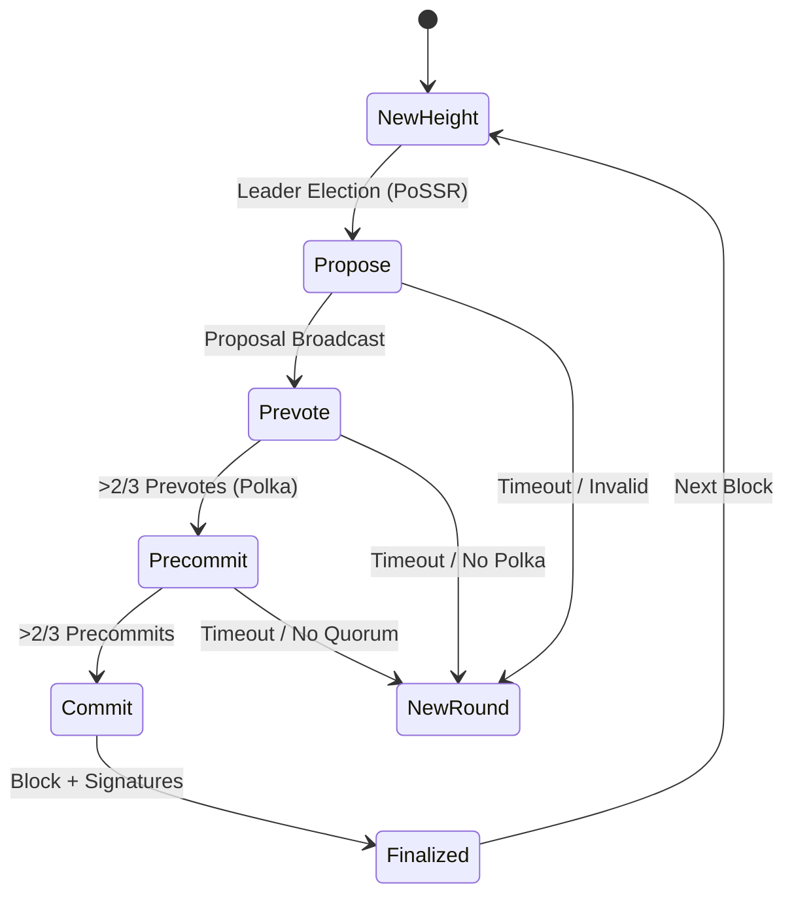
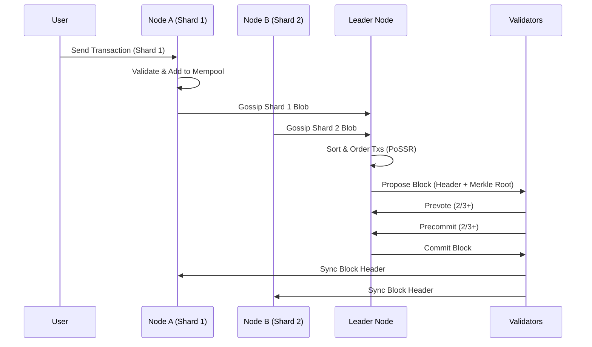

# System Architecture

> **Purpose**: This document visualizes the high-level architecture of RnR Core, showing how components interact, the data flow, and the separation of concerns.

---

## 🏗️ 1. High-Level Node Architecture

The RnR Node follows a modular architecture separating Networking, Consensus, State, and Storage.

```mermaid
graph TD
    User[User / Client] -->|JSON-RPC| API[API Layer]
    API -->|Tx| Mempool[Mempool]
    API -->|Query| StateManager[State Manager]

    subgraph "Core Logic"
        Mempool --> BlockAssembler[Block Assembler]
        BlockAssembler --> Consensus[Consensus Engine (PoSSR/BFT)]
        Consensus -->|Finalized Block| Blockchain[Blockchain Core]
        Blockchain -->|Execute| VM[Virtual Machine]
        VM -->|Update| StateDB[State Database]
    end

    subgraph "Networking"
        P2P[P2P Layer (GossipSub)]
        Consensus <-->|Votes/Proposals| P2P
        Mempool <-->|Tx Propagation| P2P
        Blockchain <-->|Block Sync| P2P
    end

    subgraph "Storage"
        StateDB --> LevelDB[(LevelDB)]
        Blockchain --> LevelDB
    end
```

---

## 🔄 2. Consensus State Machine (BFT)

The consensus engine operates as a deterministic state machine.



---

## 📦 3. Block Propagation Flow (Sharding)

How data moves through the sharded network.



---

## 🛡️ 4. Module Boundaries & Contracts

To address the "Spaghetti Code" critique, we define clear interfaces between modules.

### A. Consensus Interface
```go
type Engine interface {
    RunConsensusRound(height uint64, txs []Tx) (*Block, error)
    VerifySeal(header *Header) error
}
```

### B. State Interface
```go
type StateManager interface {
    ApplyTransaction(tx Tx) error
    GetBalance(addr Address) uint64
    Commit() (RootHash, error)
}
```

### C. P2P Interface
```go
type Network interface {
    BroadcastVote(vote *Vote) error
    BroadcastBlock(block *Block) error
    Listen(topic string, handler func([]byte))
}
```

This strict separation ensures that the Consensus engine can be swapped (e.g., PoW -> BFT) without breaking the Networking or State layers.
